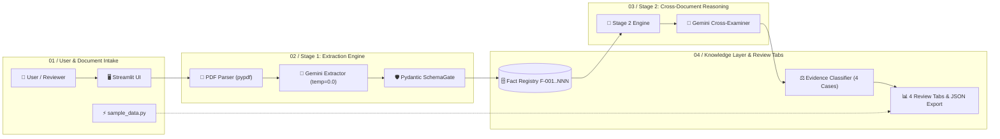

# Fact Knowledge Layer: Multi-Document Factual Analysis Engine

An evidence-based factual extraction and cross-referencing system built with Python, Streamlit, and the official Google GenAI SDK (`google-genai`).

The engine acts as a strict, grounded data parser that extracts discrete facts from uploaded PDF documents and performs multi-document cross-referencing with zero hallucinations or reliance on external training knowledge. Every claim is strictly anchored in verbatim source quotations.

---

## System Architecture & Workflow Diagram

Compiled and verified with **[Archify](https://github.com/tt-a1i/archify)** using the **Signal Flow** layout.


* **Interactive Signal-Flow Player**: [`workflow.html`](workflow.html) *(with step-by-step chapter animation, node tracing, and dark/light themes)*
* **Architecture Specification**: [`workflow.json`](workflow.json)



---

## Setup and Run Instructions

### Prerequisites
* Python 3.10 or higher
* Google Gemini API Key ([Get one free at Google AI Studio](https://aistudio.google.com/))

### 1. Clone the Repository
```bash
git clone https://github.com/LielStephen/SUPERJOINDATALYSIS.git
cd SUPERJOINDATALYSIS
```

### 2. Create and Activate a Virtual Environment
```bash
# Windows (PowerShell)
python -m venv .venv
.venv\Scripts\activate

# macOS / Linux
python3 -m venv .venv
source .venv/bin/activate
```

### 3. Install Dependencies
```bash
pip install -r requirements.txt
```

### 4. Configure API Key (Optional)
You can set your Gemini API key as an environment variable or enter it directly in the UI sidebar:
```bash
# Windows (PowerShell)
$env:GEMINI_API_KEY="your_actual_api_key_here"

# Linux / macOS
export GEMINI_API_KEY="your_actual_api_key_here"
```

### 5. Launch the Application
```bash
streamlit run app.py
```
The application opens automatically at `http://localhost:8501`.

> **Zero Setup Evaluator Walkthrough**: If reviewing without an API key, click **"⚡ Load Demo Evaluation Dataset"** on the home screen to immediately inspect precomputed extractions, verbatim quotes, and grounded reasoning across all four challenge cases.

---

## Video Demo

* **Demo Video Link**: `https://youtu.be/your-demo-video-id` *(Replace with your 3-minute video recording)*
* **Overview of Demo Walkthrough**:
  1. **Document Ingestion**: Uploading multi-page PDF disclosures in the sidebar.
  2. **Two-Stage Analysis**: Live spinner showing Stage 1 (strict factual extraction) and Stage 2 (cross-document reasoning).
  3. **The 4 Challenge Cases**: Side-by-side walkthrough of Corroborations, Contradictions, Contextual Reconciliations, and Audit Failures.
  4. **Incremental Ingestion & Export**: Appending new documents and exporting structured JSON reports.

---

## Demonstration of the Four Required Cases

The system detects and categorizes the four review cases with grounded evidence:

### Case 1: Corroborated Evidence
* **Claim**: Cloud Infrastructure segment revenue reached $4.2B with 32% year-over-year expansion in Q4 2023.
* **Source Evidence**:
  * `Q4_2023_Earnings_Release.pdf`: *"Cloud Infrastructure segment revenue reached $4.2 billion, representing 32% year-over-year expansion."*
  * `FY2023_Shareholder_Letter.pdf`: *"Our cloud business crossed $4.2B in the fourth quarter, growing by 32% compared to the prior year period."*
* **System Reasoning**: Both documents independently confirm the identical fourth-quarter cloud financial performance ($4.2 billion revenue and 32% YoY growth). While the earnings release designates the unit as 'Cloud Infrastructure segment' and the shareholder letter terms it 'our cloud business', semantic reasoning verifies the entities and metrics are identical.

### Case 2: Genuine Contradiction
* **Claim**: Conflicting total permanent workforce counts as of December 31, 2023.
* **Source Evidence**:
  * `Global_Workforce_Report_2023.pdf`: *"Total global permanent headcount as of December 31, 2023 stood at 14,200 full-time employees."*
  * `Annual_ESG_Disclosure_2023.pdf`: *"The company closed fiscal year 2023 with 15,800 active permanent employees worldwide."*
* **System Reasoning**: Direct numerical conflict between two official disclosures for the exact same reporting cutoff date. One certifies 14,200 full-time employees while the other reports 15,800 active permanent employees (a 1,600 employee discrepancy). Neither text references contractor adjustments or restructuring to justify the variance.

### Case 3: Contextual Reconciliation
* **Claim**: Apparent contradiction between reported Operating Margins (21.4% vs. 28.6%).
* **Source Evidence**:
  * `Form_10K_Annual_Report.pdf`: *"GAAP Operating Margin for fiscal year 2023 contracted to 21.4% reflecting acquisition-related restructuring charges."*
  * `Q4_Investor_Presentation.pdf`: *"Adjusted Non-GAAP Operating Margin for FY23 was 28.6%, reflecting strong core software operational leverage."*
* **System Reasoning**: The 720 basis point disparity is resolved by accounting definitions grounded in the text: Form 10-K measures GAAP margin burdened by one-off acquisition restructuring expenses, while the Investor Presentation reports Adjusted Non-GAAP margin isolating recurring operational performance.

### Case 4: Audit & Extraction Failure
* **Claim**: Strategic capital expenditure expansion with incomplete contextual referents.
* **Source Evidence**:
  * `Executive_Strategy_Memo.pdf`: *"The newly formed regional subsidiary will accelerate capital deployment by an additional 40% in the coming cycle."*
* **System Reasoning**: The extracted statement contains ambiguous referents: the legal entity ('the newly formed regional subsidiary') is unnamed in the excerpt, the percentage increase lacks a baseline capex dollar figure, and the timeframe ('in the coming cycle') cannot be grounded to a fiscal period.
* **Diagnostic Fix**: Enable cross-sentence coreference resolution to link 'the subsidiary' to prior paragraphs; ground relative temporal expressions ('coming cycle') against document metadata; flag quantitative deltas lacking baseline denominators.

---

## Approach

### 1. Two-Stage Analytical Pipeline
Rather than asking a model to perform extraction and cross-referencing in a single monolithic prompt, we separate the pipeline into two focused stages:
1. **Stage 1 (Strict Extraction)**:
   - In-memory PDF text extraction using `pypdf` with page tracking.
   - Zero-shot deterministic extraction using Gemini (`temperature=0.0`) bound to a Pydantic `ExtractionResult` response schema.
   - Mandates exact `verbatim_quote` substrings, discrete numerical/semantic metrics, and source document tags.
2. **Stage 2 (Careful Reasoning & Cross-Referencing)**:
   - Takes structured facts from Stage 1 and cross-examines all pairings across documents.
   - Classifies relationships deterministically into `Corroboration`, `Contradiction`, `Contextual Reconciliation`, or `Extraction Failure`.
   - Requires explicit evidence citations and reasoning grounded exclusively in textual context.

### 2. Engineering Decisions & Trade-Offs
* **Pydantic Response Schemas over Free-form JSON**: Eliminates parsing syntax errors and guarantees strict typing across both pipeline stages.
* **In-Memory PDF Parsing**: Bypasses temporary disk writes, ensuring secure and fast processing of sensitive user documents.
* **Deterministic Decoding (`temperature=0.0`)**: Ensures reproducible factual grounding without creative extrapolation or hallucinated relationships.
* **Incremental Ingestion Mode**: Added support to append newly uploaded documents to the existing knowledge layer without re-running extraction on historical PDFs.

### 3. AI Tools & Libraries
* **LLM**: Google Gemini (`gemini-2.5-flash`, `gemini-2.5-pro`, `gemini-2.0-flash`) via the official `google-genai` Python SDK.
* **Validation & Schemas**: `pydantic` v2.
* **PDF Extraction**: `pypdf`.
* **Frontend**: `streamlit`.
* **Architecture Modeling**: `Archify` (Signal Flow layout).

---

## Limitations and Next Steps

### Current Limitations
1. **Scanned / Image-Only PDFs**: Text extraction relies on digital text layers in PDFs. Scanned image documents without OCR return empty text.
2. **Large Multi-Hundred-Page PDF Latency**: Very large document corpuses require chunked batching to stay within context windows and avoid rate limit delays.
3. **Complex Tables & Footnotes**: Dense financial statement tables with nested footnotes can occasionally lose row/column structural associations during raw text extraction.

### Next Steps & Future Work
* **OCR Integration**: Integrate Google Document AI or Tesseract OCR for scanned PDF support.
* **Entity Knowledge Graph**: Build an interactive graph visualization (using PyVis / NetworkX) showing fact nodes, document edges, and relationship links.
* **Dynamic Domain Schema Evolution**: Allow the knowledge layer to auto-cluster emerging domain ontologies as new document types are ingested.
* **Vector-Grounded Hybrid Retrieval**: For multi-thousand-page corporate filings, implement chunk-level vector indexing to retrieve relevant candidate facts before LLM cross-referencing.

---

## Additional Notes

* **No Hardcoded Rules**: The system is completely document-agnostic. It does not hardcode schemas, company names, or metric fields.
* **Credentials Kept Secure**: No API keys or secrets are stored in this repository. API keys are passed strictly at runtime via environment variables, Streamlit secrets, or user input in the UI.
* **Self-Contained Evaluation**: A precomputed evaluation dataset is embedded via `sample_data.py` allowing reviewers to test all functionality without requiring API credits.
